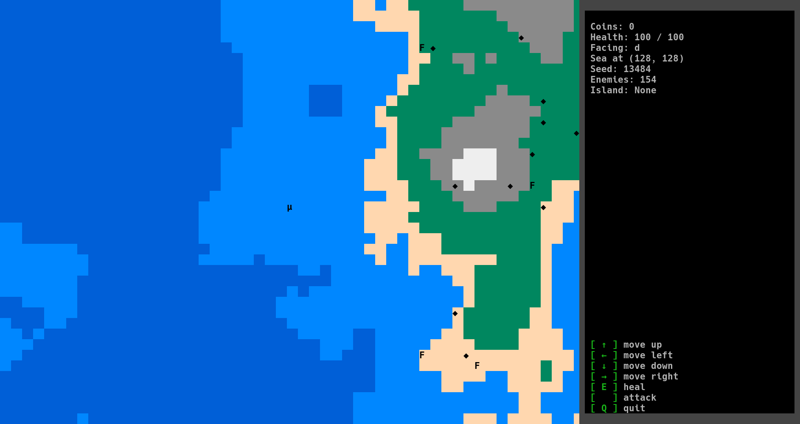

# kipferl

A basic roguelike game written in Python and curses.

# Setup

## Prerequisits

* Python 3.8 or above

* a terminal emulator with 8-bit colour support

  * cmd.exe, Powershell, Konsole, and GNOME Terminal are officially supported and tested.

  * If you use other terminal emulators, however, they are still highly likely to work.

  * IDLE is not a terminal emulator, and trying to run the game in IDLE will raise an error.

## Installation

* Run `python -m pip install -r requirements.txt` to install dependencies.

  * On Windows, please also add `windows-curses` to `requirements.txt`.

    * OS-dependent installation is planned for a later date, but not possible without meddling with official tests.

* Run `python main.py` to launch the game.

  * On Windows, you may double-click `start-on-windows` instead, for convenience.
  
    * Also, there is an opportunity to set an icon to `start-on-windows` file. For that purpose just place a game directory in your user directory or change it manually in file's properties (the icon is placed in `assets\img` directory).

# Documentation

[You can find documentation here.](https://acipensersturio.github.io/kipferl/html/kipferl/src)

# Options

You may customise your playing experience by editing defines in assets/defines.json.

# License

`AcipenserSturio/kipferl` is licensed under GPL-3.0, while acknowledging the copyright notice of MIT.

Files licensed under MIT are taken from `fpl-programming/programming-2022-20fpl` and will be removed in a later version.
